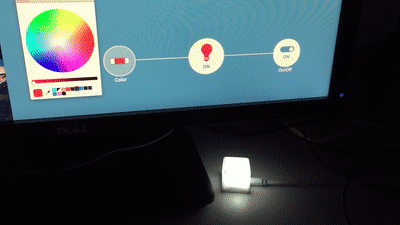

# Blinkstick Adapter
To learn something you have to touch it, to grab it, to break it.



## Notes and TODO
* Gateway setup for mac os is well documented in their repo.
* dependency has to be compiled and bundled with the package I guess?
* What is the point of Device>Property>setCachedValue?
* How does a Property reference the Device. -> Property can access device with `this.device`
* Why can property have a custom name and a name that comes from the spec? -> So you can have multiple on/off in the properties. But for the UI to recognize it the name has to be the same as the field Property in the spec.

## Commands to get it running
```bash
# get example
git clone https://github.com/mozilla-iot/example-adapter

# link it into the mozilla addons folder
# if you delete it just link it again
ln -s /Users/youruser/path/to/example-adapter/ /Users/youruser/.mozilla-iot/addons/

# edit code in VS code
code example-adapter

# enabled addon
http://localhost:8080/settings/addons

# after making changes, I did restart the whole gateway
npm start

```


## Material
* [https://hacks.mozilla.org/2018/02/creating-an-add-on-for-the-project-things-gateway/](https://hacks.mozilla.org/2018/02/creating-an-add-on-for-the-project-things-gateway/)
* [blinkstick-node](https://github.com/arvydas/blinkstick-node)
